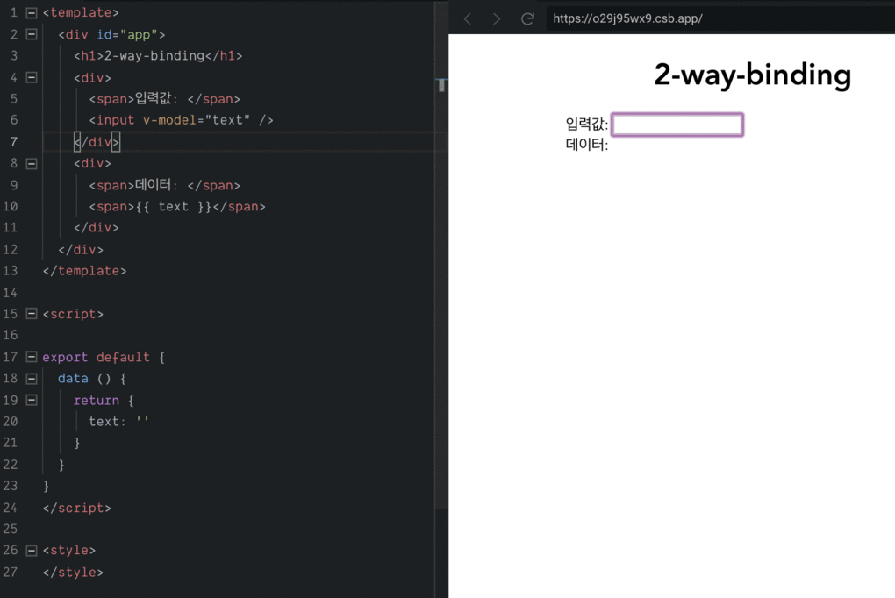
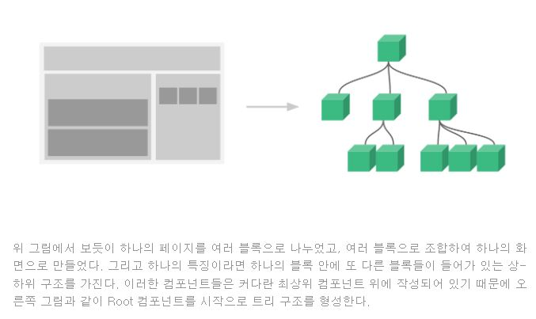
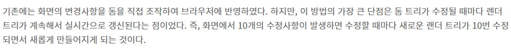
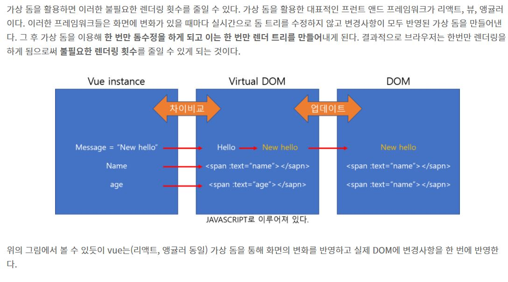

# 11월 30일 스터디 내용

## 1) vue.js 전반적인 내용 공유
## 2) 유익해 보이는 강의 정리
## 3) 블로그 후기
## 4) 결과

---

## 1. vue.js 전반적인 내용 공유

- Vue.js 채택 이유(https://blog.buildit.kr/post/7)

  - 작고 가벼운 크기
  - 상세한 공식 문서 및 낮은 러닝커브 
  - 싱글 파일 컴포넌트
  - Virtual DOM 지원
  - 양방향 바인딩(2-way-bindings) 지원
  - 크로스 플랫폼 프레임워크


- 뷰 (VueJS) 
  ```
  앵귤러나 리액트와 비교해서 뷰는 프리코딩(pre-coding) 구조를 가지고 있어서, 그 성능을 양보하지 않고도 애플리케이션을 빠르게 개발할 수 있게 해준다. 
  그리고 명령이 쉽기 때문에, 개발 과정에서 원하는 것을 정확하게 이용할 수 있습니다. 
  뷰를 사용하면 앱 개발이 쉽고 빠르다. 
  따라서 스타트업에게 아주 좋다고 할 수 있다.
  ```
- [vue.js란 ](https://mkil.tistory.com/435?category=734440)
 
- [단방향 / 양방향 데이터 바인딩 설명](https://authorkim0921.tistory.com/13)
  

- [React vs Vue 장단점 비교](https://velog.io/@leehaeun0/React-vs-Vue-%EC%9E%A5%EB%8B%A8%EC%A0%90-%EB%B9%84%EA%B5%90)
  
- 뷰의 구조

  ```
  이러한 컴포넌트 기반의 프레임워크를 사용함으로써 코드의 재사용성이 향상되며 직관적인 화면 구조를 갖게 되는 것이다.

  변경이 일어날 때 화면 전체를 다시 그리지 않고 프레임워크에서 정의한 방식에 따라 화면을 갱신한다. 따라서 브라우저 입장에서는 성능 부하가 줄어들어 일반 렌더링 방식보다 더 빠르게 화면을 그릴 수 있다.
  ```

- MVVC 패턴 [MVVC패턴 설명](https://blog.yena.io/studynote/2019/03/16/Android-MVVM-AAC-1.html)
  ```
  뷰(Vue.js)는 UI 화면 개발 방법 중 하나인 MVVM 패턴의 뷰 모델에 해당하는 화면단 라이브러리이다.
  ```

- 가상 돔



- 설치 방법
  - https://kr.vuejs.org/v2/guide/installation.html


---
## 2.  유익해 보이는 강의 정리

- [인프런 웹 앱 만들기](https://www.inflearn.com/course/vue-pwa-vue-js-%EC%A4%91%EA%B8%89) 49,500원
- [프로그래머스 웹 앱 만들기](https://programmers.co.kr/learn/courses/4672) 20,000원

- [Vuejs 간단 채팅앱 만들기1](https://velog.io/@kay/Vuejs%EB%A1%9C-%EC%B1%84%ED%8C%85%EC%95%B1-%EB%A7%8C%EB%93%A4%EA%B8%B0-6yjnj4u6r6) 

- [Vue.js로 간단한 채팅 앱 만들기2](https://ichi.pro/ko/vue-jslo-gandanhan-chaeting-aeb-mandeulgi-77156039509677) 

- [Vue js - 초보 입문 강좌 #1. 뷰? ,개발환경 준비](https://www.youtube.com/watch?v=DmgAvJhK3YE&list=PLpJDjPqxGWGrkyxxavs2oW-SK3v_8VLwa) 

- [2분영상, 아주 쉬운 VueJS, Todo 앱 만들기(미리보기)! 입문자용](https://www.youtube.com/watch?v=XDh1Gej_vQI) 
  
- [VUE.JS(9) 할일 관리 앱 만들기](https://blog.naver.com/PostView.naver?blogId=yura0501&logNo=222493657641&parentCategoryNo=&categoryNo=39&viewDate=&isShowPopularPosts=true&from=search) 

- [[VueJS Tutorial] 외부 API를 이용한 날씨 앱 만들기](https://smoh.tistory.com/352)
  
- [Vue.js와 NativeScript로 앱개발을 하기위한 환경 세팅하는 방법](https://ux.stories.pe.kr/185)
  
- [Node.js와  Vue.js를 이용해 프론트엔드 웹 서버를 만들기](https://imasoftwareengineer.tistory.com/39)
  
- [[Vue/Vuex] 뷰 실습 - Todo 웹앱 만들기 (1)](https://nykim.work/74)


- [[Vue.js] Vue.js 실무 프로젝트에 적용하면 좋은 내용 정리](https://jess2.xyz/vue/vue-tip/)


- [vue.js 예제 모음 사이트](https://vuejsexamples.com/)
---


## 3.  후기

- [vue.js 포기담](https://yuja-kong.tistory.com/entry/nativescript-vue-%EC%95%B1-%EA%B0%9C%EB%B0%9C-%EB%8F%84%EC%A0%84%EA%B8%B0%EB%9D%BC%EA%B3%A0-%EC%93%B0%EA%B3%A0-%ED%8F%AC%EA%B8%B0%EB%8B%B4%EC%9D%B4%EB%9D%BC%EA%B3%A0-%EC%9D%BD%EB%8A%94%EB%8B%A4)

- 대부분 라이브러리가 중국어로 되어있다는 얘기가 있음.
  

---

## 4.  결과

- 자바로 하는게 나을지 고민

- [[Android 개발일지] 안드로이드 스튜디오로 일기장 만들기 - 1 (기획, 메인, 목록 화면 만들기)](https://hanyeop.tistory.com/89)

- [[Android] 안드로이드 로그인 페이지 구현하기 #2 - 서버와 연동하기](https://m.blog.naver.com/rhrkdfus/221397524547)


- [[데이그랩 앱따라만들기]1. 메인화면 디자인하기](https://codeasy.tistory.com/27)